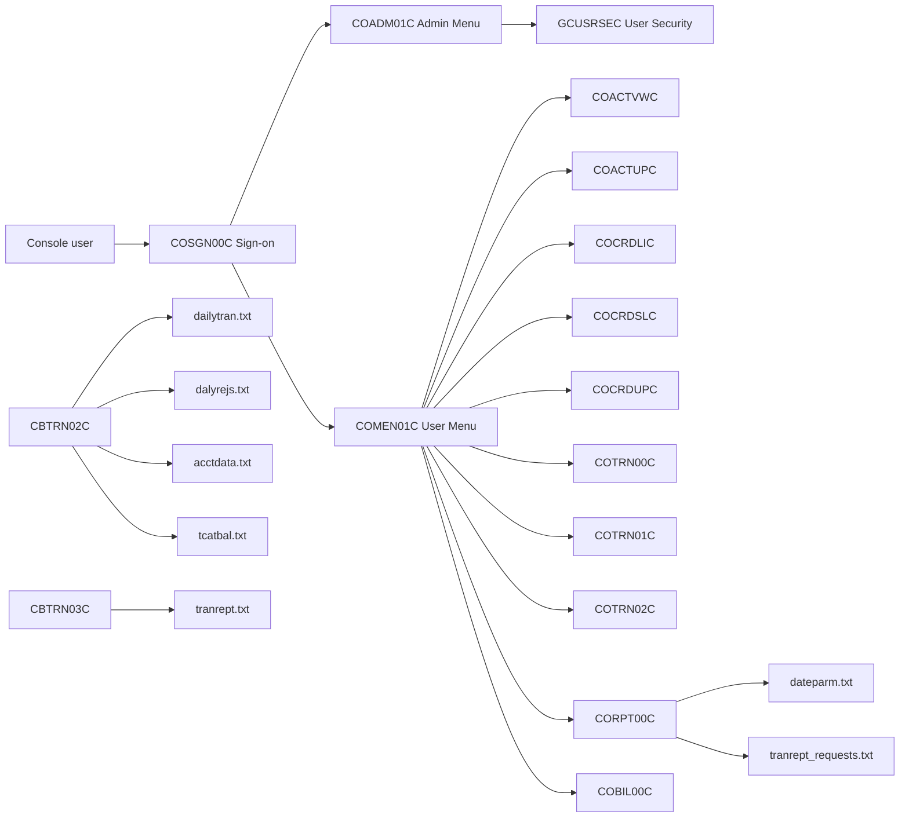
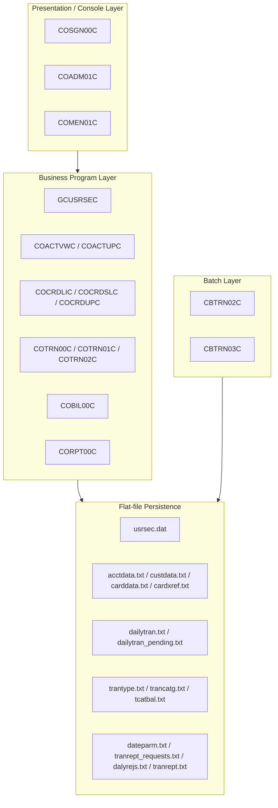
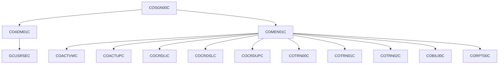
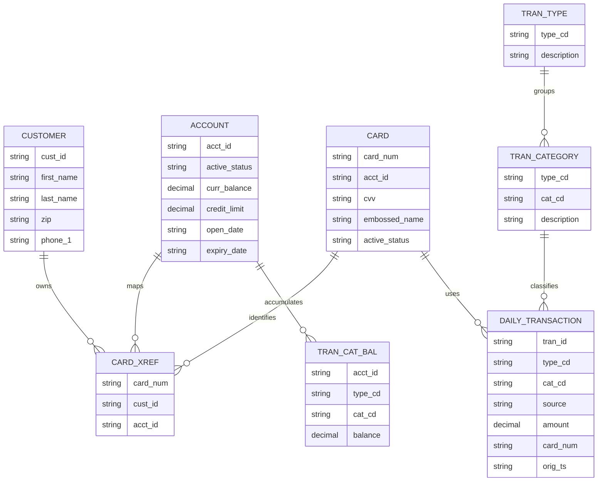
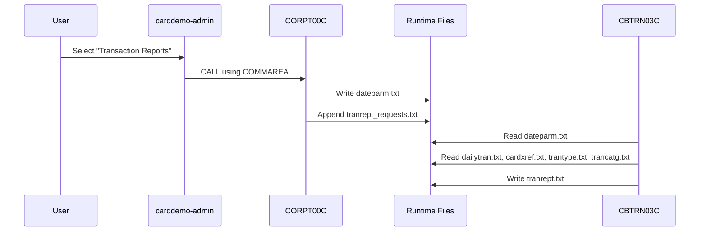
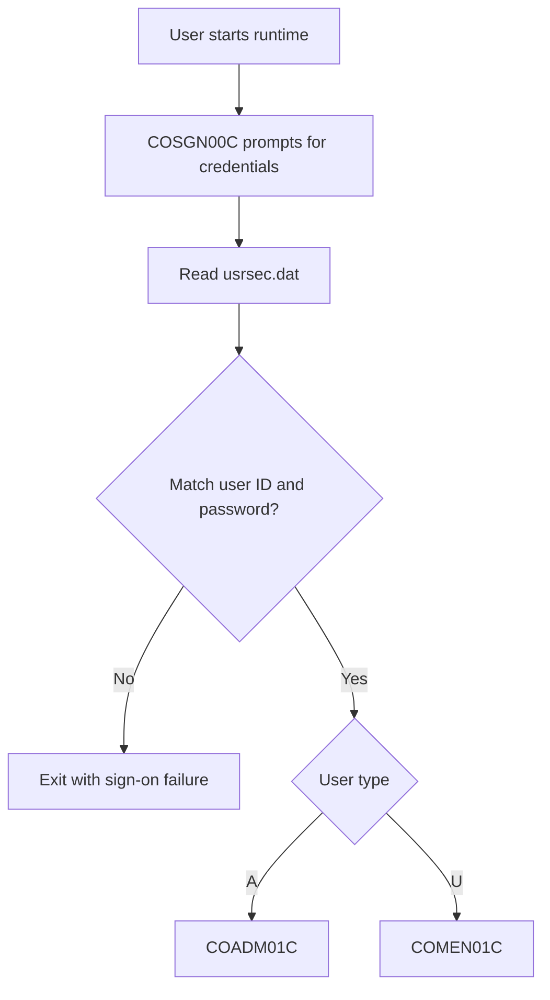
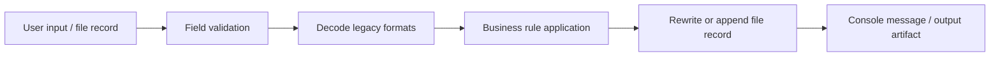

# CardDemo GNU COBOL Design

## Table of Contents
- [Executive Summary](#executive-summary)
- [System Overview](#system-overview)
- [Architecture](#architecture)
- [Module Structure](#module-structure)
- [Domain Model](#domain-model)
- [Service Layer](#service-layer)
- [Web Layer](#web-layer)
- [REST API Layer](#rest-api-layer)
- [Security Architecture](#security-architecture)
- [Database Design](#database-design)
- [Configuration Management](#configuration-management)
- [Cross-Cutting Concerns](#cross-cutting-concerns)
- [Architecture Assessment](#architecture-assessment)

## Executive Summary
This document describes the design of the GNU COBOL version of the CardDemo legacy application. The GNU COBOL runtime preserves the base business flows of the original CICS/VSAM application while replacing the terminal and middleware dependencies with a standalone console executable and flat-file persistence in `app/data/ASCII`.

The current runtime supports:
- Console sign-on and role-based navigation
- User security administration
- Account inquiry and update
- Credit card inquiry and update
- Transaction list, view, and add
- Bill payment
- Transaction report request capture
- Batch posting and batch transaction report generation

The design intentionally keeps the original program decomposition, copybook-driven record layouts, and batch/offline operating model so the application remains suitable for modernization analysis, reverse engineering, and incremental refactoring.

## System Overview
The GNU COBOL implementation is a file-backed runtime for the base CardDemo application slice. It does not require CICS, BMS, VSAM, Db2, IMS, or MQ for the supported flows. Instead, it executes as native GNU COBOL binaries and reads and writes line-sequential flat files.

Primary runtime artifacts:
- `build/carddemo-admin`: interactive console runtime for online-style flows
- `build/post-transactions`: batch posting executable
- `build/transaction-report`: batch reporting executable

Primary data stores:
- `app/data/ASCII/usrsec.dat`
- `app/data/ASCII/acctdata.txt`
- `app/data/ASCII/custdata.txt`
- `app/data/ASCII/carddata.txt`
- `app/data/ASCII/cardxref.txt`
- `app/data/ASCII/dailytran.txt`
- `app/data/ASCII/dailytran_pending.txt`
- `app/data/ASCII/tcatbal.txt`
- `app/data/ASCII/trantype.txt`
- `app/data/ASCII/trancatg.txt`
- `app/data/ASCII/dateparm.txt`
- `app/data/ASCII/tranrept_requests.txt`
- `app/data/ASCII/dalyrejs.txt`
- `app/data/ASCII/tranrept.txt`

## Architecture
The runtime uses a layered but program-centric architecture. Each user-visible function remains a dedicated COBOL program. Navigation is performed with static `CALL` statements and a shared COMMAREA-style linkage structure rather than network calls or middleware dispatch.

Architectural characteristics:
- Entry-point driven console runtime
- Direct program-to-program control transfer
- File-backed persistence with copybook-aligned fixed layouts
- In-memory tables for update-heavy flows
- Separate online and batch executables
- Environment-variable based path indirection

## Module Structure
The GNU COBOL runtime keeps the legacy module names to preserve traceability back to the original mainframe application.

### Online Console Modules
| Program | Responsibility |
| :------ | :------------- |
| `COSGN00C` | Sign-on, credential validation, role routing |
| `COADM01C` | Admin menu |
| `GCUSRSEC` | User maintenance: list, add, update, delete |
| `COMEN01C` | User menu |
| `COACTVWC` | Account inquiry |
| `COACTUPC` | Account and customer update |
| `COCRDLIC` | Credit card list |
| `COCRDSLC` | Credit card detail inquiry |
| `COCRDUPC` | Credit card update |
| `COTRN00C` | Transaction list |
| `COTRN01C` | Transaction detail |
| `COTRN02C` | Transaction add |
| `COBIL00C` | Bill payment |
| `CORPT00C` | Report request launcher |

### Batch Modules
| Program | Responsibility |
| :------ | :------------- |
| `CBTRN02C` | Post pending transactions, update balances, write rejects |
| `CBTRN03C` | Produce transaction report from posted transactions |

## Domain Model
The domain model is defined by legacy copybooks and fixed-position records rather than by relational schemas or object models. `cardxref.txt` is the central association file linking customer, account, and card identities.

Core record types:
- User security: `CSUSR01Y`
- Customer: `CVCUS01Y`
- Account: `CVACT01Y`
- Card: `CVACT02Y`
- Card/customer/account cross-reference: `CVACT03Y`
- Transaction: `CVTRA06Y`
- Transaction type: `CVTRA03Y`
- Transaction category: `CVTRA04Y`
- Transaction category balance: `CVTRA01Y`

## Service Layer
There is no separate service tier in the distributed-system sense. In this runtime, the service layer is embodied inside the COBOL programs themselves. Each program owns its validation, file I/O, mapping, and update logic, with COMMAREA fields carrying session context between calls.

Service patterns used in the codebase:
- Lookup services implemented as sequential scans over flat files
- Update services implemented by loading files into in-memory OCCURS tables and rewriting them
- Validation services embedded in each transaction program
- Report request capture separated from report generation
- Batch posting separated from online transaction capture

Representative service responsibilities:
- `GCUSRSEC`: user lifecycle management
- `COACTVWC` and `COACTUPC`: account and customer retrieval/update
- `COCRDSLC` and `COCRDUPC`: card retrieval/update
- `COTRN02C`: transaction validation and append
- `CBTRN02C`: settlement-style posting and account/category balance updates
- `CBTRN03C`: filtering, enrichment, sorting, and report formatting

## Web Layer
The GNU COBOL legacy runtime has no web layer. Unlike the sample project, this implementation does not include browser pages, server-rendered HTML, or a JavaScript frontend.

Equivalent design decision:
- Terminal/BMS interaction was replaced by console prompts and `DISPLAY`/`ACCEPT`
- User journeys still exist, but they are command-line dialogues rather than screens served over HTTP
- Program boundaries remain aligned with the original online transactions for future UI replacement if needed

If this application is modernized later, the current program boundaries can be used as the seams for a future web interface.

## REST API Layer
The GNU COBOL runtime has no REST API layer. Programs communicate through direct subprogram calls inside the same process, and batch integration is file-based.

Current integration style:
- In-process `CALL` statements for online flow composition
- Shared linkage structure for user/session context
- Flat files for asynchronous handoff between online request capture and batch execution

## Security Architecture
Security is intentionally lightweight and local to the runtime. Authentication and authorization are file-backed and role-based.

Controls in scope:
- User credentials stored in `usrsec.dat`
- Role discriminator in each user record: admin or regular user
- Role-based branching from sign-on to admin or user menus
- Default bootstrap users written when the user security file is missing
- Program-level authorization by menu exposure rather than a centralized policy engine

Security limitations of the current runtime:
- Passwords are stored in plain text
- No hashing, encryption, or external identity provider integration
- No audit trail beyond operational file changes
- No record-level access filtering per customer/account ownership

## Database Design
The GNU COBOL runtime replaces the original VSAM and optional Db2/IMS stores with line-sequential files. The data model still behaves like a legacy operational database, but persistence is file-oriented.

Design characteristics:
- One logical entity per flat file
- Fixed-width record layouts defined by copybooks
- Cross-reference file used instead of joins or foreign-key enforcement
- Sequential read access for lookups
- Full-file rewrite strategy for many updates
- Separate operational files for pending work, rejects, and output reports

### Logical File Inventory
| File | Purpose |
| :--- | :------ |
| `usrsec.dat` | User credentials and roles |
| `acctdata.txt` | Account master |
| `custdata.txt` | Customer master |
| `carddata.txt` | Card master |
| `cardxref.txt` | Card to customer/account relationship |
| `dailytran.txt` | Posted transaction history |
| `dailytran_pending.txt` | Pending transaction queue for batch posting |
| `tcatbal.txt` | Per-account transaction category balances |
| `trantype.txt` | Transaction type reference data |
| `trancatg.txt` | Transaction category reference data |
| `dateparm.txt` | Report selection window |
| `tranrept_requests.txt` | Submitted report request log |
| `dalyrejs.txt` | Batch reject output |
| `tranrept.txt` | Generated report output |

## Configuration Management
Configuration is intentionally simple and file-system centric.

Build and runtime controls:
- `scripts/build_gnucobol_runtime.sh`
- `scripts/build_gnucobol_batch.sh`
- `scripts/init_gnucobol_data.sh`
- `scripts/reset_gnucobol_data.sh`
- `scripts/check_non_cics_slice.sh`

Environment variable overrides:
- `CARDDEMO_ACCT_PATH`
- `CARDDEMO_CUST_PATH`
- `CARDDEMO_CARD_PATH`
- `CARDDEMO_XREF_PATH`
- `CARDDEMO_TRAN_PATH`
- `CARDDEMO_PENDING_TRAN_PATH`
- `CARDDEMO_REPORT_REQUEST_PATH`
- `CARDDEMO_DATEPARM_PATH`
- `CARDDEMO_TRANTYPE_PATH`
- `CARDDEMO_TRANCATG_PATH`
- `CARDDEMO_TCATBAL_PATH`
- `CARDDEMO_REJECT_PATH`
- `CARDDEMO_REPORT_OUTPUT_PATH`
- `CARDDEMO_USRSEC_PATH`

Initialization strategy:
- Seed master data is committed in `app/data/ASCII.seed`
- Active runtime files are created or reset into `app/data/ASCII`
- Operational output files are created on demand or truncated during reset

## Cross-Cutting Concerns
Several design concerns recur across the runtime:

### Data Encoding and Parsing
- Monetary values use legacy signed numeric conventions that must be decoded and reformatted
- File records are accessed by fixed character positions
- Dates are handled as text in `YYYY-MM-DD` form for runtime portability

### Error Handling
- Programs check COBOL file status codes after open/read/write operations
- Many failures are reported directly to the console and terminate the current flow
- Batch posting returns a non-zero code when rejects are produced

### State Management
- User/session state is carried in a COMMAREA-style linkage structure
- Update programs commonly load the entire file into an OCCURS table before mutation
- Batch executables treat files as the durable handoff boundary

### Observability
- Observability is currently console-oriented
- Operational evidence exists in generated artifacts such as reject files, request logs, and output reports
- The non-CICS guard script enforces that the active slice remains free of `EXEC CICS`, `DFHAID`, and `DFHBMSCA`

## Architecture Assessment
### Strengths
- Preserves original legacy module boundaries and naming
- Easy to build and run locally without mainframe middleware
- Good fit for analysis, demonstrations, and modernization planning
- Clear separation between online capture and offline batch processing
- Copybook-defined records make data structures explicit and stable

### Trade-offs
- No true transactional integrity across multiple files
- Sequential file scans limit scalability
- Rewriting full files for updates is simple but inefficient
- Security model is suitable for demo use, not production use
- Presentation, validation, and persistence concerns are still co-located in many programs

### Recommended Next Modernization Steps
1. Extract file access logic into reusable subprograms or service adapters.
2. Externalize validation and record-mapping rules where duplication is high.
3. Replace plain-text credentials with hashed secrets if the runtime will be shared.
4. Introduce automated regression coverage for online flows and batch outputs.
5. Use the existing program boundaries as the contract for a future API or web UI.

Overall, the GNU COBOL design is intentionally pragmatic: it keeps the legacy application's operational shape while making it runnable, inspectable, and extensible on a standard developer workstation.
